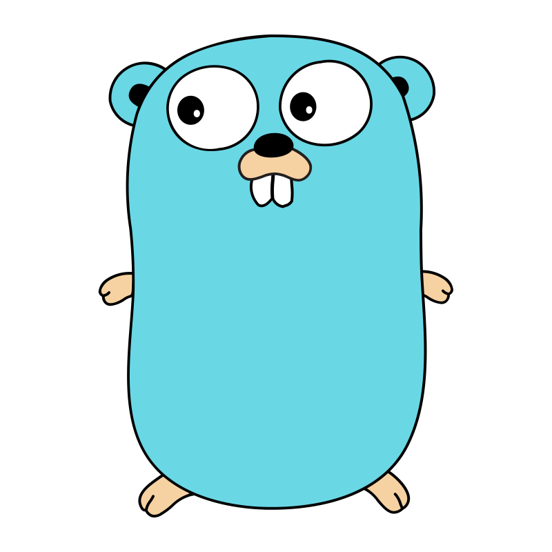

# Goilerplate

Modern UI Components for Go & Templ

## About

Goilerplate is a growing library of modern UI components designed specifically for Go and Templ. It aims to bridge the gap between Go's server-side efficiency and modern, interactive front-end experiences. Whether you're building a small website or a large web application, Goilerplate provides the tools you need to create sleek, responsive interfaces with ease.

## Features

- **Go-native Implementation**: Optimized for Go developers, seamlessly integrating with Go backends.
- **Templ-first Design**: Leverages the full power of Templ for type-safe, high-performance templating.
- **Server-Side Rendering (SSR) Focus**: Excellent performance and SEO benefits out of the box.
- **Alpine.js Integration**: Enhanced client-side interactivity when needed.
- **Tailwind CSS Styling**: Modern, utility-first styling that's highly customizable.
- **Accessible Components**: Built with accessibility in mind, following WCAG guidelines.
- **TypeSafe**: Utilizing Go's type system for robust, error-resistant development.

## Current Status

- Actively growing component library
- Regular updates and bug fixes
- Continuous development based on community feedback
- Check our [Components page](https://goilerplate.com/docs/components) for the latest list of available components

## Getting Started

Visit our website at [https://goilerplate.com/docs/getting-started](https://goilerplate.com/docs/getting-started) to get started with Goilerplate. You'll find documentation, examples, and guides to help you integrate Goilerplate into your Go projects.

## Changelog

See [CHANGELOG.md](CHANGELOG.md) for a detailed list of changes in each version.

## Contributing

We welcome contributions from the community! Whether it's adding new components, improving existing ones, or enhancing documentation, your input is valuable. Please check our [Contributing Guidelines](CONTRIBUTING.md) for more information on how to get involved.

## Feedback

Your feedback is crucial in shaping the future of Goilerplate. If you have suggestions, feature requests, or encounter any issues, please open an issue on our GitHub repository or reach out to us through our website.

## License

Goilerplate is open-source software licensed under the [MIT license](LICENSE).

## Support

For support, questions, or discussions, please [open an issue](https://github.com/axzilla/goilerplate/issues) on our GitHub repository.

---

Built with ❤️ by the Go community, for the Go community.

