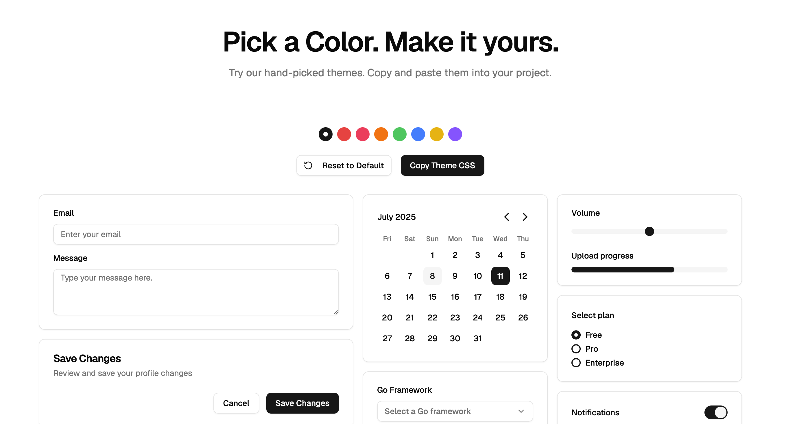

# templUI

The UI Kit for templ

## About

templUI is an enterprise-ready library of UI components designed specifically for templ. It utilizes lightweight Vanilla JavaScript for enhanced interactivity and Tailwind CSS for elegant styling. Built with CSP compliance, minimal dependencies, and modern development practices in mind, templUI provides everything you need to create professional, performant web applications.

## Features

- **Enterprise Ready**: Built for production use with security and scalability in mind
- **CSP Compliant**: Secure by design with Content Security Policy support
- **HTMX Optimized**: Seamless integration with HTMX for dynamic interactions
- **Component Driven**: Flexible, composable components for rapid development
- **Fully Customizable**: Adapt components to match your brand and requirements
- **Lightweight Vanilla JS**: Uses pure JavaScript for interactivity, ensuring minimal overhead and maximum performance.
- **Type-Safe**: Leveraging Go's type system for robust development
- **Server-Side Focused**: Excellent performance and SEO benefits
- **Modern Stack**: Go, Templ, Vanilla JavaScript, and Tailwind CSS working in harmony

## Quick Start

Visit our [documentation](https://templui.io/docs/how-to-use) for detailed installation and usage instructions.

For a ready-to-go setup, check out our [Quickstart Template](https://github.com/axzilla/templui-quickstart).

## Components

Explore our growing list of components in the [components documentation](https://templui.io/docs/components).

## Inspiration

templUI draws inspiration from several popular UI libraries and frameworks:

- [shadcn/ui](https://ui.shadcn.com/)
- [Pines UI](https://devdojo.com/pines)
- [daisyUI](https://daisyui.com/)

We're exploring whether to make templUI a strict port of shadcn/ui or to create a unique blend of various inspirations. The project is still evolving, and community feedback will play a crucial role in shaping its direction.

## Current Status

- **Heavy Development**: The project is under active development. Expect frequent updates and potential breaking changes until we reach a stable version.
- Actively growing component library
- Regular updates and bug fixes
- Continuous development based on community feedback

## Contributing

We welcome contributions from the community! Whether it's adding new components, improving existing ones, or enhancing documentation, your input is valuable. Please check our [contributing guidelines](CONTRIBUTING.md) for more information on how to get involved.

## License

templUI is open-source software licensed under the [MIT license](LICENSE).

## Support

For support, questions, or discussions, please [open an issue](https://github.com/axzilla/templui/issues) on our GitHub repository or [visit our community (GitHub Discussions)](https://github.com/axzilla/templui/discussions).

---

Built with ❤️ by the Go community, for the Go community.
